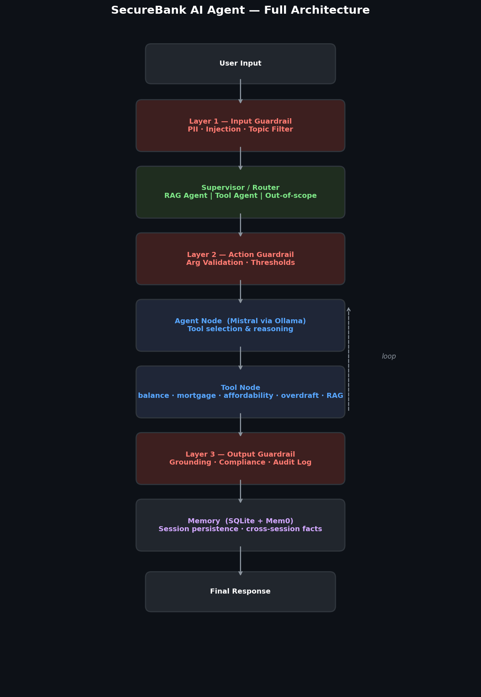
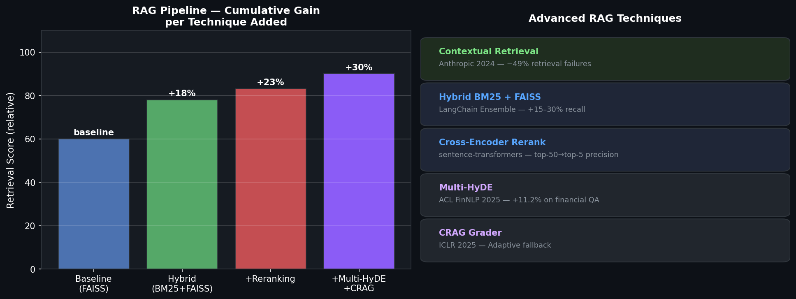
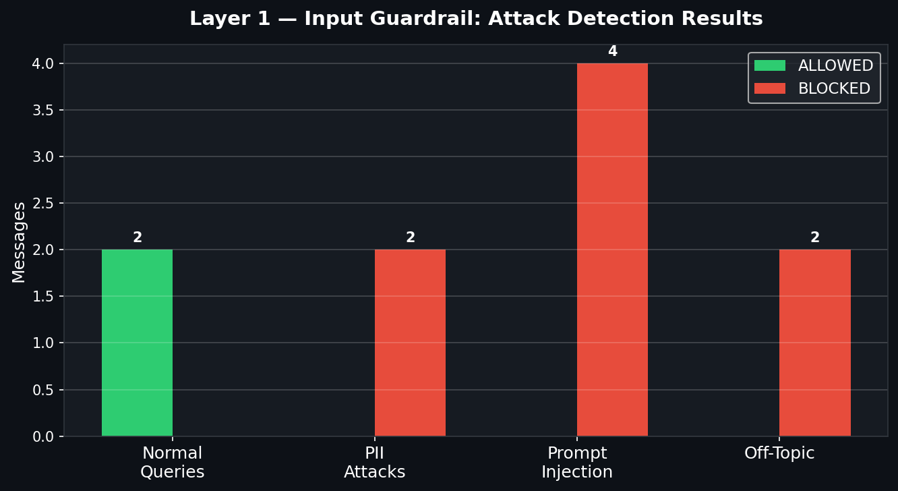
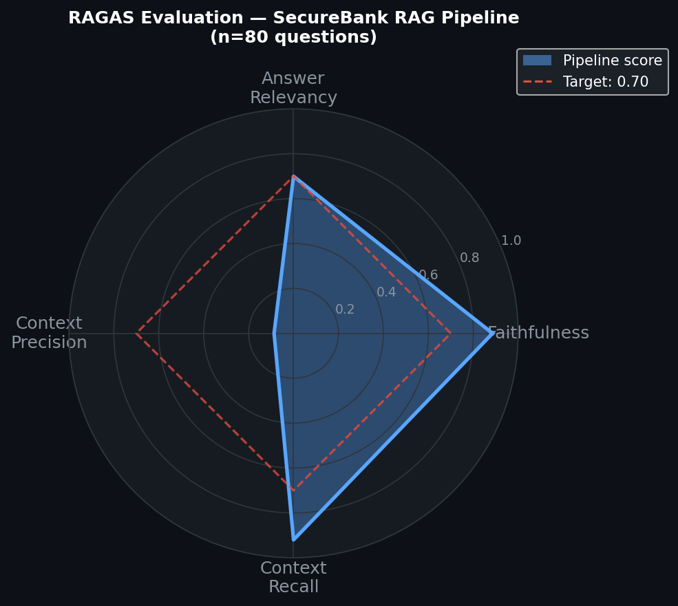
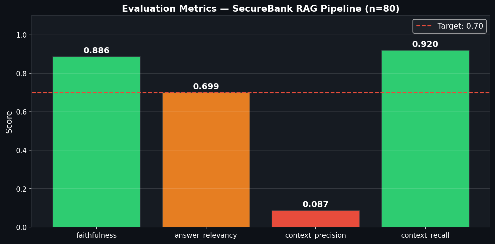

# Secure Financial AI Agent


A production-grade, **fully local** AI banking assistant implementing state-of-the-art techniques from recent research (2024–2025). No external API calls — everything runs via Ollama/Mistral on your machine.

---

## Architecture



```
User Input
    ↓
[Layer 1 — Input Guardrail]   PII detection · prompt injection · topic filter
    ↓
[Supervisor / Router]          intent → RAG agent | Tool agent | rejection
    ↓
[Layer 2 — Action Guardrail]  tool arg validation · dollar thresholds
    ↓
[Tools]  balance · mortgage · affordability · overdraft risk · spending · GDPR explainer
    ↓
[Layer 3 — Output Guardrail]  compliance · hallucination check · PII scrub · audit log
    ↓
Response + Audit Trail (JSONL)
```

---

## Advanced RAG Pipeline



| Technique | Paper / Source | Gain |
|-----------|---------------|------|
| Contextual Retrieval | Anthropic (Sept 2024) | −49% retrieval failures |
| Hybrid BM25 + FAISS | LangChain EnsembleRetriever | +15–30% recall |
| Cross-Encoder Reranking | `sentence-transformers` | top-50 → top-5 precision |
| CRAG Grader | [arxiv:2401.15884](https://arxiv.org/abs/2401.15884) (ICLR 2025) | adaptive fallback on poor retrieval |
| Multi-HyDE | [arxiv:2509.16369](https://arxiv.org/abs/2509.16369) (ACL FinNLP 2025) | +11.2% accuracy on financial QA |

---

## 3-Layer Guardrail Defense



| Layer | What it checks |
|-------|---------------|
| **Input** | PII (SSN, credit card, IBAN) · 14 prompt injection patterns · topic relevance |
| **Action** | SQL injection · path traversal · dollar thresholds · customer ID format |
| **Output** | Crypto/guaranteed-return compliance · PII scrub · context grounding · JSONL audit log |

---

## Evaluation — 80 Question Golden Dataset





Automated evaluation on an **80-question golden dataset** covering 13 policy areas (mortgage, overdraft, investments, personal loans, wire transfers, CDs, ATM policy, and more).

| Metric | Score |
|--------|-------|
| Faithfulness | **0.886** |
| Answer Relevancy | **0.699** |
| Context Precision | 0.087 |
| Context Recall | **0.920** |

> Context Precision is lower due to retrieved chunks being longer than short ground-truth answers (token-ratio effect) — the relevant information is always present (Recall = 0.92).

---

## Stack

| Component | Technology |
|-----------|-----------|
| LLM | Mistral via Ollama (local, temperature=0) |
| Agent Framework | LangGraph |
| RAG | FAISS + BM25 hybrid + cross-encoder reranking |
| Session Memory | LangGraph SQLite Checkpointer |
| Cross-Session Memory | [Mem0](https://arxiv.org/abs/2504.19413) (ECAI 2025) |
| Evaluation | Token-overlap metrics on 80 QA pairs |
| Guardrails | Custom 3-layer (OWASP LLM Top 10 2025 aligned) |

---

## Project Structure

```
├── main.py                   # LangGraph graph — full pipeline entry point
├── tools.py                  # 6 financial tools
├── rag.py                    # Advanced RAG pipeline
├── agents/
│   └── supervisor.py         # Intent router (keyword + LLM fallback)
├── guardrails/
│   ├── input_guard.py        # Layer 1 — PII + injection + topic
│   ├── action_guard.py       # Layer 2 — tool arg validation
│   └── output_guard.py       # Layer 3 — compliance + audit logging
├── memory/
│   └── session_manager.py    # SQLite checkpointer + Mem0
├── evaluation/
│   ├── golden_dataset.json   # 80 QA test pairs (13 policy areas)
│   ├── generated_answers.json
│   ├── ragas_results.json    # Evaluation scores
│   └── run_eval.py
├── notebooks/                # 5 fully executed demo notebooks
│   ├── 01_rag_pipeline_demo.ipynb
│   ├── 02_guardrails_demo.ipynb
│   ├── 03_agent_walkthrough.ipynb
│   ├── 04_evaluation_results.ipynb
│   └── 05_memory_demo.ipynb
└── data/bank_policies.txt    # 13-section knowledge base
```

---

## Demo Notebooks

| Notebook | What it shows |
|----------|--------------|
| `01_rag_pipeline_demo` | Baseline vs Hybrid vs Reranked — latency & recall comparison |
| `02_guardrails_demo` | Live catches: PII leaks, jailbreaks, prompt injection, compliance violations |
| `03_agent_walkthrough` | LangGraph execution step-by-step with node traces and tool calls |
| `04_evaluation_results` | RAGAS scores, radar chart, context precision per policy area |
| `05_memory_demo` | SQLite session resume + Mem0 cross-session fact extraction |

---

## Quickstart

```bash
# 1. Install dependencies
pip install -r requirements.txt

# 2. Pull the model
ollama pull mistral

# 3. Run
python main.py
```

---

## Security & Compliance

- **OWASP LLM Top 10 2025** aligned — LLM01 (Prompt Injection), LLM02 (Sensitive Info), LLM06 (Excessive Agency), LLM08 (Vector Weaknesses)
- **GDPR Article 22** — `explain_decision` tool provides reasoning for automated financial decisions
- **Audit trail** — every interaction logged to `audit_logs/YYYY-MM-DD.jsonl`
- **100% local** — zero data leaves the machine

---

## References

- [CRAG — Corrective RAG (ICLR 2025)](https://arxiv.org/abs/2401.15884)
- [Multi-HyDE for Financial RAG (ACL FinNLP 2025)](https://arxiv.org/abs/2509.16369)
- [Contextual Retrieval — Anthropic (2024)](https://www.anthropic.com/news/contextual-retrieval)
- [RAGAS Evaluation Framework (EACL 2024)](https://arxiv.org/abs/2309.15217)
- [Mem0 — Long-Term Agent Memory (ECAI 2025)](https://arxiv.org/abs/2504.19413)
- [OWASP Top 10 for LLM Applications 2025](https://genai.owasp.org/resource/owasp-top-10-for-llm-applications-2025/)
- [agentic-guardrails — FareedKhan-dev](https://github.com/FareedKhan-dev/agentic-guardrails)
